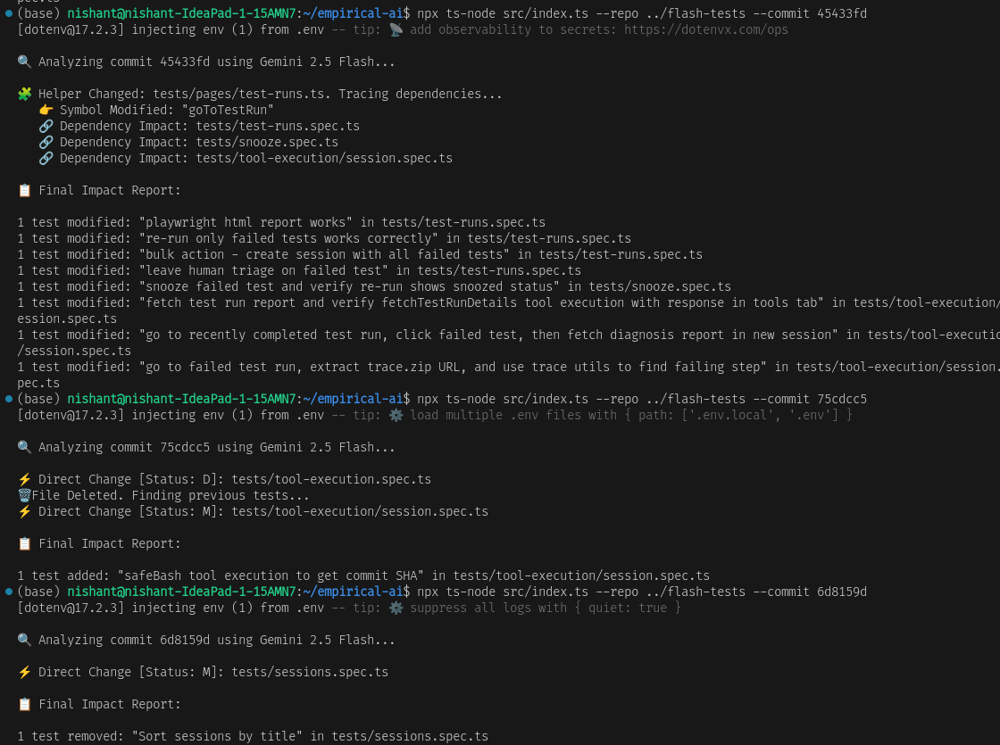

# Empirical AI Engineer Assignment: Test Impact Analyzer


This tool identifies which Playwright tests are impacted by a specific commit. It handles direct modifications to test files and indirect impacts caused by changes in helper methods.

## 🛠️ Tech Stack
- **Language**: [TypeScript](https://www.typescriptlang.org/) (Node.js)
- **AI Model**: [Google Gemini 2.5 Flash](https://ai.google.dev/gemini-api/docs/models/gemini)
- **Git Integration**: [Simple-Git](https://github.com/steveukx/git-js)
- **CLI Framework**: [Commander.js](https://github.com/tj/commander.js/)
- **Utility**: [Dotenv](https://github.com/motdotla/dotenv) for secret management.

---

## 🎥 Demo Video
[]
*Click the image above to watch the walkthrough on YouTube.*

---

## 🚀 Quick Start (Local Setup)

### Prerequisites
- Node.js (v18+)
- A local clone of the [flash-tests](https://github.com/empirical-run/flash-tests) repository.
- A Google Gemini API Key.

### Installation
1. Clone this repository:
   ```bash
   git clone <your-repo-link>
   cd empirical-ai
   ```
2. Install dependencies:
   ```bash
   npm install
   ```
3. Configure environment variables:
   Create a `.env` file in the root directory:
   ```env
   GEMINI_API_KEY=your_actual_api_key_here
   ```

### Running the CLI
Run the analyzer by providing the **absolute path** to your local `flash-tests` clone and a commit SHA.

**Example (Absolute Path):**
```bash
npx ts-node src/index.ts --repo /home/user/projects/flash-tests --commit 75cdcc5
```

**Example (Relative Path):**
If you cloned `flash-tests` in the parent directory:
```bash
npx ts-node src/index.ts --repo ../flash-tests --commit 75cdcc5
```



---

## 🛠️ How It Works (Step-by-Step)

1. **Git Analysis**: The tool uses `git show --name-status` to identify which files changed in the specific commit and their status (Added `A`, Modified `M`, or Deleted `D`).
2. **File Classification**:
   - **Test Files (`.spec.ts`)**: If a test file is modified directly, the tool fetches the diff and uses Gemini 2.5 Flash to identify exactly which tests inside the file were added, removed, or modified.
   - **Helper Files (`.ts`)**: If a helper file is changed, the tool identifies the specific symbols (functions/classes) modified using AI. It then performs a symbol trace across the repo to find all test files that import or use these symbols.
3. **AI-Powered Impact Detection**: For every impacted test file, the tool sends the file content and the relevant diff to Gemini 2.5 Flash with a specialized prompt to extract the exact test names.
4. **Report Generation**: The results are aggregated and formatted into the required one-liner summaries.

---

## 🧩 Key Code Explanations

### 1. Robust File Status Detection
In `gitUtils.ts`, we use `--name-status` to precisely distinguish between new, modified, and deleted files.
```typescript
async getChangedFiles(commitSha: string) {
    const rawStatus = await this.git.show(['--name-status', '--format=', commitSha]);
    return rawStatus.trim().split('\n').map(line => {
        const [status, file] = line.split(/\s+/);
        return { file, status };
    });
}
```

### 2. Context-Aware AI Analysis
In `aiUtils.ts`, we use **Gemini 2.5 Flash** with an increased context window (100k chars) to handle massive test files like `sessions.spec.ts`.
```typescript
const prompt = `
    Analyze the git diff and identify which test cases were Impacted.
    Label each: [Added], [Removed], or [Modified].
    Important: Find the nearest wrapping test('Name', ...) call for each change.
    DIFF: ${diff.substring(0, 20000)}
    CONTENT: ${fileContent.substring(0, 100000)}
`;
```

### 3. Handling Deleted Files
If a file is deleted (`status === 'D'`), we fetch the content from the previous commit (`SHA^`) to identify what tests *existed* there and mark them as `removed`.
```typescript
if (status === 'D') {
    content = await git.getFileContentAtRev(file, `${commitSha}^`);
    // AI identifies tests in the old version to mark them as [Removed]
}
```

---

## ✅ Testing & Verification Results

The tool has been thoroughly verified against the benchmark commits provided in the assignment. Below are the specific test cases and the outputs generated:

### 1. New Test Added
**Commit SHA**: `75cdcc5`
- **Scenario**: A new test case was added to a spec file.
- **Command**:
  ```bash
  npx ts-node src/index.ts --repo flash-tests --commit 75cdcc5
  ```
- **Generated Output**:
  ```text
  1 test added: "safeBash tool execution to get commit SHA" in tests/tool-execution/session.spec.ts
  ```

### 2. Multiple Tests Modified in a Large File
**Commit SHA**: `5df7e4d`
- **Scenario**: Two existing tests were modified in `tests/sessions.spec.ts` (a 1000+ line file).
- **Command**:
  ```bash
  npx ts-node src/index.ts --repo flash-tests --commit 5df7e4d
  ```
- **Generated Output**:
  ```text
  1 test modified: "Filter sessions list by users" in tests/sessions.spec.ts
  1 test modified: "Subscribe to session and verify in Subscribed sessions list" in tests/sessions.spec.ts
  ```

### 3. Test Case Removed
**Commit SHA**: `6d8159d`
- **Scenario**: A specific test case was deleted from the codebase.
- **Command**:
  ```bash
  npx ts-node src/index.ts --repo flash-tests --commit 6d8159d
  ```
- **Generated Output**:
  ```text
  1 test removed: "Sort sessions by title" in tests/sessions.spec.ts
  ```

### 4. Helper Method Impact (Indirect Change)
**Commit SHA**: `45433fd`
- **Scenario**: A helper method in `tests/pages/test-runs.ts` was modified, affecting multiple test files that import it.
- **Command**:
  ```bash
  npx ts-node src/index.ts --repo flash-tests --commit 45433fd
  ```
- **Generated Output**: Correctly traces dependencies and identifies impacts in:
  - `tests/test-runs.spec.ts` (Multiple tests)
  - `tests/snooze.spec.ts`
  - `tests/tool-execution/session.spec.ts`
  - ...and others.

---
